<div align="center">

# Nova

**A desktop IDE that brings IntelliJ-grade code intelligence, an API client, a browser, a security scanner and an AI pair to one window — then shares the whole session, screen and voice included, over a link.**

[](CHANGELOG.md)
[](LICENSE)
[](https://www.electronjs.org/)
[](https://react.dev/)
[](https://www.typescriptlang.org/)
[](tests/FEATURES.md)
[](docs/INSTALLATION.md)

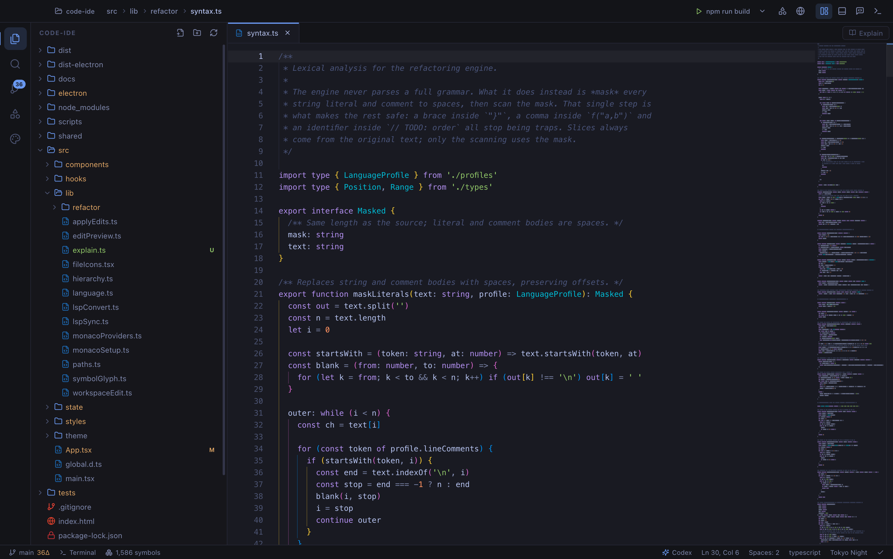

</div>

---

## What it is

Nova is a full IDE in an Electron window: the Monaco editor, a project-wide symbol
index, twenty-three refactorings, a debugger, a test runner, Git with a
three-way merge editor, a real Chromium pane, a UML/architecture diagram
designer, an API client, an end-to-end test recorder, a security scanner, a
plugin host, and an AI console wired to the `claude`, `codex` and `opencode`
CLIs — and, through the first of those, to Kimi, GLM and DeepSeek.

Three things make it unusual:

**It works with nothing installed.** The whole project is indexed on open by a
per-language declaration parser, and that index — not a language server — drives
go-to-definition, find usages, go-to-symbol, autocomplete, **rename**, code
vision, breadcrumbs and every other refactoring. Reformat Code and Optimize
Imports have their own built-in implementations too. Install a language server
and everything becomes type-aware; don't, and it still works.

**It explains itself.** An **Explain** button above any open file generates a
full walkthrough of that code — the theory behind it, a step-by-step trace,
live Mermaid system-design diagrams, and a build-it-yourself tutorial.

**It shares itself.** One button opens a Cloudflare tunnel and turns the session
into a link. Whoever holds it watches the project read-only in a browser — and,
if you want, your screen, camera and voice along with it. No account, no
install, nothing to join.

---

## A look at it

<table>
<tr>
<td width="50%" valign="top">

**The editor, with no language server**

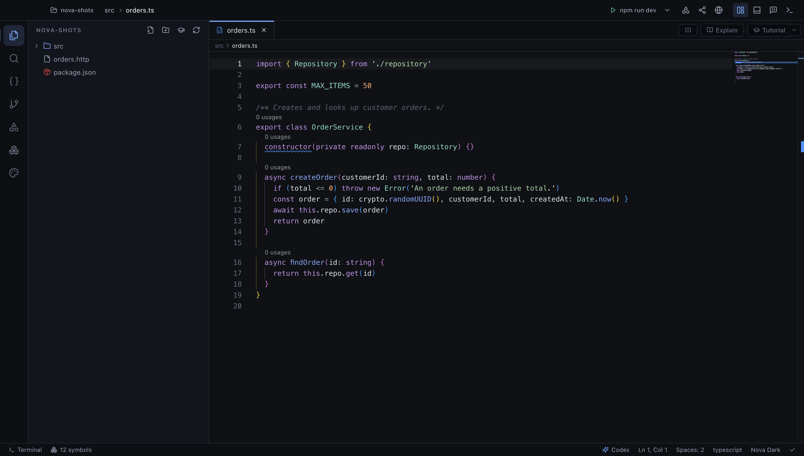

Go-to-definition, find usages, go-to-symbol, autocomplete and twenty-three
refactorings all run off Nova's own index of the project — built on open, in
about half a second for a 1,200-file tree. Install a language server and it
becomes type-aware; don't, and none of it stops working.

</td>
<td width="50%" valign="top">

**An API client that lives in the repo**

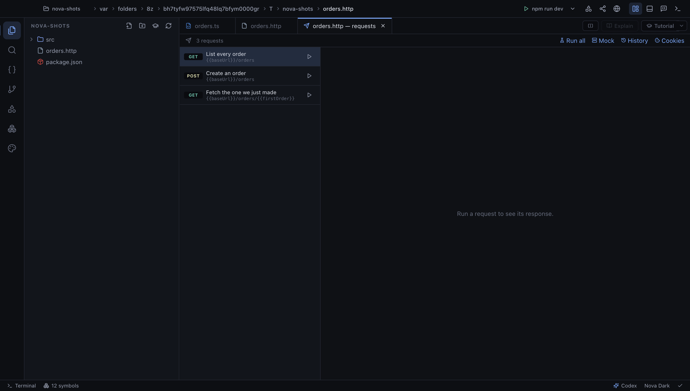

A `.http` file *is* the collection, so it diffs and merges like code. HTTP,
GraphQL, gRPC and WebSocket in one format, with assertions, chained values,
environments, OpenAPI import and a mock server.

</td>
</tr>
<tr>
<td width="50%" valign="top">

**An agent that plans before it writes**

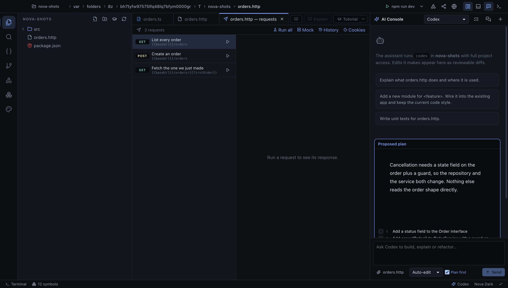

A request that will change files is planned first, read-only. Strike out any
step you do not want; nothing is written until you press Approve. Steps then
tick over in place while it works.

</td>
<td width="50%" valign="top">

**…and keeps the record**

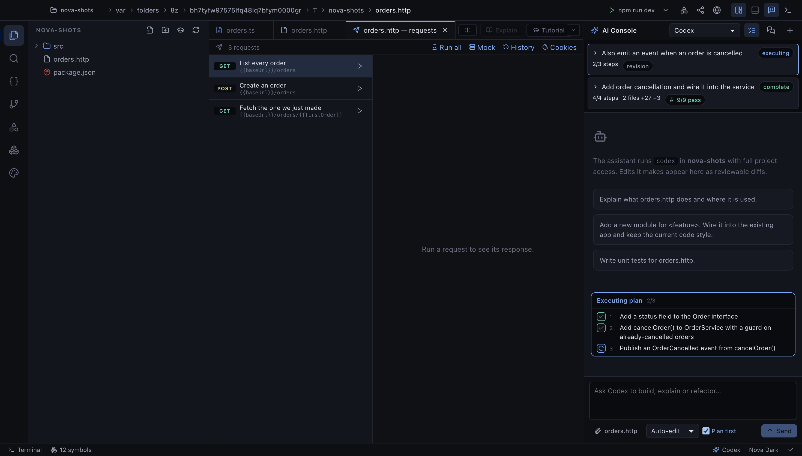

Every plan is kept. A second attempt is filed as a **revision** and shown as a
diff of the checklist. When a plan finishes, Nova runs the project's own tests
and stamps the verdict on it — `9/9 pass`, or what broke.

</td>
</tr>
<tr>
<td width="50%" valign="top">

**Share the session — screen, camera, voice**

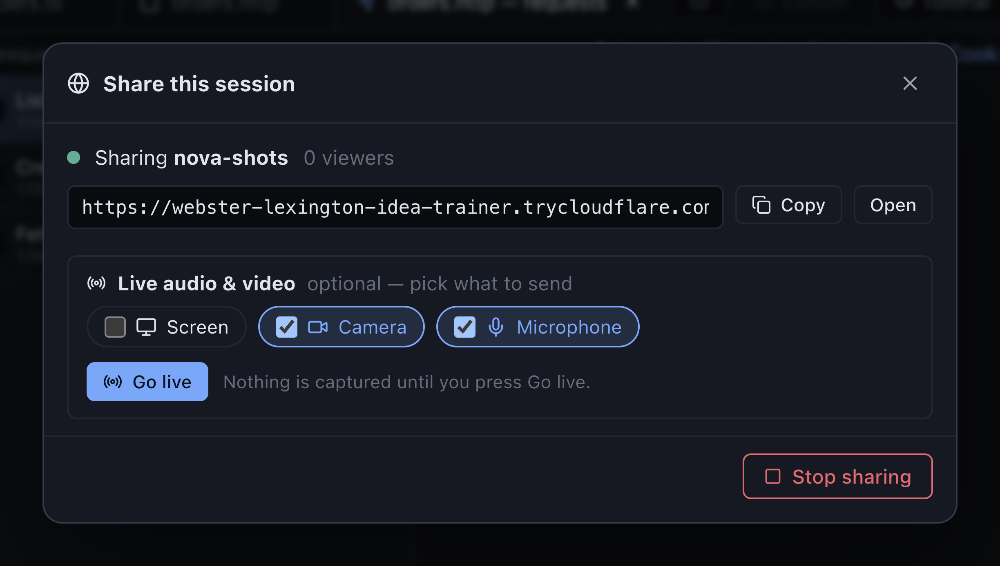

One button opens a Cloudflare tunnel. Whoever holds the link reads the project
in a browser — and, if you tick them, sees your screen and hears you. Nothing to
install on their side, and no write path exists on the server at all.

</td>
<td width="50%" valign="top">

**Seven assistants, one console**

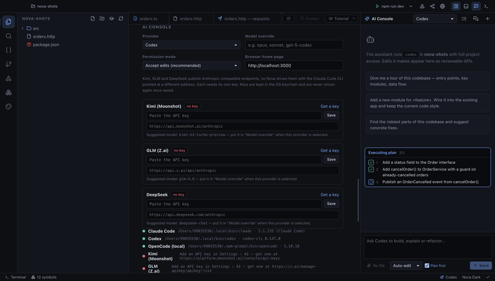

Each assistant runs the CLI its vendor ships — `claude`, `codex`, `gemini`,
`kimi`, and `opencode` for GLM, DeepSeek and local models. Nothing impersonates
anyone else's API, and keys live in the OS keychain.

</td>
</tr>
<tr>
<td width="50%" valign="top">

**Security scanning built in**

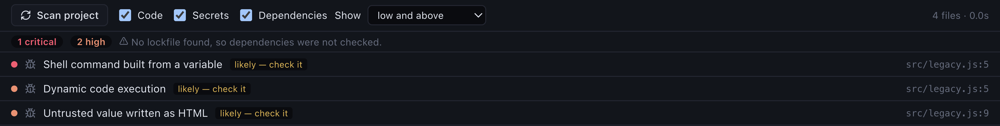

Secrets, a SAST pass with CWE-tagged findings, and a dependency audit across
nine lockfile ecosystems. Worst first, and every finding states its
**confidence** out loud rather than implying it.

</td>
<td width="50%" valign="top">

**Plugins, sandboxed**

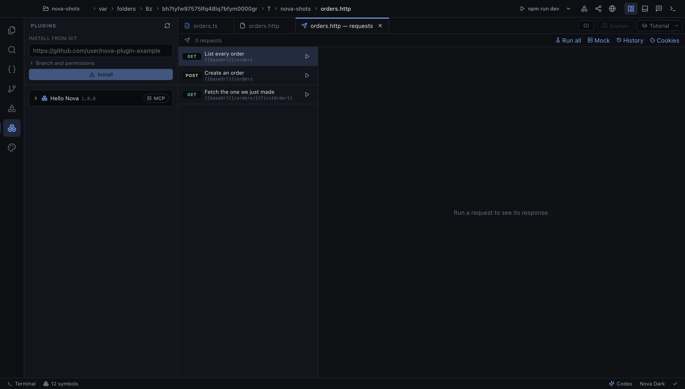

A plugin is a git repository with a manifest. Its code runs in a separate host
process, and a permission it was not granted fails at the call site with the
permission named. Plugins can also hand the AI console new MCP tools.

</td>
</tr>
</table>

---

## Install

There is no download to grab — Nova is not published to a store or a release
feed, so you build it once from source. Requires **Node.js 20+**, npm and git.

### Install it as an application

Build a real desktop app and install it the way you would any other:

```bash
git clone https://github.com/byte-mods/Nova.git && cd Nova
```

```bash
npm install
```

```bash
npm run dist:mac
```

That writes `release/Nova-<version>-arm64.dmg` (and a matching `.app`). Open the
DMG and drag **Nova** to Applications:

```bash
open release
```

Or install it without the DMG step:

```bash
cp -R "release/mac-arm64/Nova.app" /Applications/
```

On an Intel Mac the folder is `release/mac/`. Use `npm run dist` for the current
platform — Windows produces an installer, Linux an AppImage.

> **macOS Gatekeeper.** The build is unsigned, so the first launch is refused
> with *"Nova is damaged"* or *"cannot be opened"*. Clear the quarantine flag
> once and it opens normally from then on:
>
> ```bash
> xattr -cr /Applications/Nova.app
> ```

### Or run it from source

For hacking on Nova itself, skip the packaging step:

```bash
npm run dev
```

Nova opens on the welcome screen — **Open folder…** points it at a project, and
it indexes the tree on open.

### Optional tooling

Nothing else is required. Language servers, debug adapters and the `claude` /
`codex` CLIs are all optional: Nova probes your `PATH` at startup, uses whatever
it finds, and lists the rest in **Settings** with an install command for each.

Sharing a session over a public link is the one feature with an outside
dependency — it needs `cloudflared`, and says so in the dialog if it is missing:

```bash
brew install cloudflared
```

> **npm 10.9+ blocks install scripts**, so Electron's binary may not download.
> If you see `Electron failed to install correctly`, run
> `npm install-scripts approve electron` and reinstall. Full instructions,
> optional tooling and platform notes: **[docs/INSTALLATION.md](docs/INSTALLATION.md)**

---

## Features

A short tour. The complete reference is in **[docs/FEATURES.md](docs/FEATURES.md)**.

### Code intelligence without tooling

The project is indexed on open — a 1,200-file tree builds in ~0.5 s and answers a
find-usages query in ~20 ms. The index is incremental, so edits (including the AI
console's) land immediately.

- **⌘-click / `F12`** — go to definition, across files
- **⌥F7** — find usages, grouped by file, each labelled *declaration* / *usage* /
  *import*, with comment and string matches behind a toggle
- **⇧⌘O** — go to symbol in project, with kind badges and containers
- **Autocomplete** in every language, fed by the index

Declarations are parsed per language, covering TypeScript/JavaScript, Python, Go,
Rust, Java, Kotlin, Scala, Swift, Objective-C, C, C++, C#, Ruby, PHP, Dart,
Elixir, Erlang, Haskell, Clojure, Lua, R, Julia, Perl, shell, PowerShell, SQL,
GraphQL, Protobuf, HCL/Terraform, Solidity, CSS/SCSS, F#, Visual Basic and
Pascal.

### Twenty-three refactorings, on IntelliJ's keymap

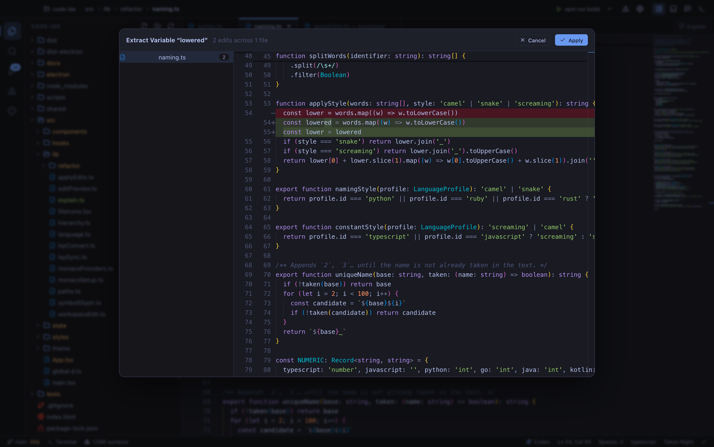

**⌃T** opens *Refactor This* — everything that applies where the caret is, with
the rest explaining why they don't.

| | | | |
|---|---|---|---|
| `⇧F6` Rename | Rename File | Rename Directory / Package | `⌥⌘V` Extract Variable |
| `⌥⌘C` Extract Constant | `⌥⌘F` Extract Field | `⌥⌘M` Extract Method | `⌥⌘P` Extract Parameter |
| Extract Interface | Extract Superclass | `⌥⌘N` Inline Variable | Inline Method |
| Inline Parameter | Inline Field | `⌘F6` Change Signature | Introduce Parameter Object |
| Encapsulate Field | Invert Boolean | Convert Anonymous to Inner | `F6` Move File |
| Move Class | Pull Up · Push Down | `⌘⌫` Safe Delete | |

Every one ends in the preview above — affected files, edit count, per-file diff —
before a byte is written. None of them needs a language server.

The engine masks strings and comments, then reasons over what is left. That is
why it works on any project with no tooling, and why it **refuses rather than
guesses**: a variable assigned twice won't inline, a selection producing two live
values won't extract, and a language with no profile says so instead of writing
something plausible-looking.

### Explain this file

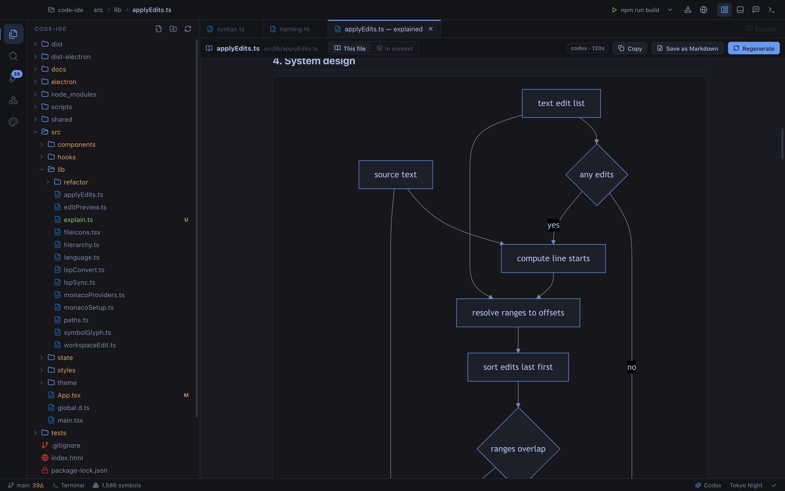

Press the **Explain** button (or `⌥⌘E`). A read-only agent run reads the file —
optionally its imports, callers and tests too — and streams back:

1. what it is, in one paragraph
2. **the concept behind it** — the algorithm, pattern or protocol it instantiates
3. how it works, step by step, against the real identifiers
4. **system design** — a component flowchart, a sequence diagram of one full
   operation, plus class or ER diagrams where the file warrants them
5. a table of everything it exposes
6. the design decisions, and what each one costs
7. **build it yourself** — a tutorial reconstructing the idea from nothing
8. pitfalls, and three exercises against this codebase

Diagrams render live as they arrive, in the active theme. The run is isolated
from the AI console and uses plan-mode permissions, so a walkthrough can never
edit the thing it describes. Copy it, or save it into the project as Markdown.

### Explain the whole project

The **Tutorial** button next to Explain (or `⇧⌥⌘E`) does the same thing at
project scale: it reads the repository and writes the technical documentation
nobody wrote while it was being built.

Nine chapters, each generated on its own or all at once as one document:

| | |
|---|---|
| **Tour** | what it is, the map, and the order to read the files in |
| **Stack** | every library and framework, its job, and what breaks without it |
| **Architecture** | processes, layers, and who may call whom |
| **Patterns** | the design patterns actually present, each with the code that proves it |
| **Algorithms** | the real algorithms and data structures, with complexity |
| **Data** | what is stored where, the schema, and the actual queries |
| **Flows** | end-to-end traces of the main operations, as sequence diagrams |
| **Security** | trust boundaries and what stops untrusted input doing damage |
| **Pipeline** | how source becomes a running app, and what the suites cannot catch |

The prompt contract is deliberately hostile to hand-waving: every structural
claim must carry a `path:line`, every technique must be named with the name you
can go and search, every decision must be paired with the cost it accepts, and
*"not present in this repository"* is a required, allowed answer. It ends with a
build-it-yourself tutorial and three exercises against your own code.

The chevron picks which assistant writes it — the two produce noticeably
different documents from the same repository, so it is a per-run choice rather
than a setting. **Save into project** writes it to `docs/TUTORIAL.md`.

### A terminal that is actually a terminal

The shell runs on a real pseudo-terminal, so `vim`, `top`, `less`,
`git rebase -i` and password prompts all work, the width follows the pane, and
Ctrl+C interrupts the foreground job rather than the shell.

### Debugging, tests and language servers

- **Debug Adapter Protocol** — breakpoints, step over/into/out, call stack,
  scoped variables, watch expressions, debug console. `debugpy`, `dlv`,
  `lldb-dap` and `codelldb` are pre-configured. Breakpoints **persist per
  project** and support **conditions, hit counts and log points**.
- **Tests** — frameworks detected from the project (go, cargo, pytest, vitest,
  jest, rspec, PHPUnit, Gradle, Maven, npm). Results appear as a grouped tree
  with pass/fail counts and durations; a green ▶ in the gutter runs one test.
- **LSP** — 24 servers pre-configured. When one is present, navigation becomes
  type-aware and you gain rename, quick fixes, formatting, inlay hints,
  signature help, and call/type hierarchy.

### The rest of the IDE

- **Find Action** (`⇧⌘P`) — every app command *and* every editor action by name,
  with its keybinding. **Recent Files** (`⌘E`), **File Structure** (`⌘F12`),
  **Bookmarks** (`F11`).
- **Split editors** (`⌥⌘→`), draggable and pinnable tabs, Close Others.
- **Replace in Path** (`⇧⌘R`) with a preview, file masks, and a **TODO** panel.
- **Explorer multi-select** (`⌘`/`⇧`-click), right-click **Find in Folder**, and
  **Safe Delete** — deleting from the tree lists what still imports it first.
- A banner when a file changes on disk under unsaved edits — Reload, Compare or
  Keep mine.

### Git, browser, diagrams and the AI console

- **Git** — branch picker, per-file staging, commit, history, commit viewer with
  colourised diffs, blame in the gutter, stash, revert, cherry-pick, reset.
- **Browser** — a real Chromium pane with an address bar, devtools and
  responsive presets. If a page fails to load it offers to start your dev server.
- **Diagrams** — `.nova-diagram.json` files open in a canvas editor with ten
  shapes, 50 icons, UML relationships and SVG/PNG export, or in a live Mermaid
  source editor. Six starter templates.
- **AI console** — Claude, Codex, **Kimi**, **GLM**, **DeepSeek**, or a **local
  model** via OpenCode + Ollama running in your project, streaming tool calls,
  with every touched file becoming a reviewable change card with a diff and a
  revert button.
- **Local history** — every overwrite snapshotted independently of Git, including
  the AI's. Browse, diff and restore any revision.
- **Ten themes** driving the whole application, and three file-icon packs.

### An API client, in the repository

A `.http` file *is* the collection. It sits next to the code it exercises, it
diffs, and it merges — which is the part a GUI client with its own private
database cannot do.

- **HTTP, GraphQL, gRPC and WebSocket** in one format, with a cookie jar that
  survives redirects, seven auth schemes, file uploads and multipart bodies.
- **Assertions and chaining** — a `> ` block after a request runs tests
  against the response and captures values for later requests to use.
- **Environments and variables**, resolved per run, kept out of the file.
- **Data-driven runs** — point a request at a CSV or JSON file and it runs once
  per row.
- **OpenAPI import** turns a spec into a request file; **the mock server** serves
  that spec back, so a client can be built before the API exists.
- **History** — every response kept, reopenable, diffable.

### Testing tools

- **Unit tests** — nine frameworks detected and run from the tree, with a green
  ▶ in the gutter for a single test, and **coverage** overlaid on the editor.
- **API tests** — run one request, a whole file, or every collection in the
  project, with a results panel that shows both sides of a failed assertion.
- **End-to-end** — record a real interaction in the browser pane and it writes a
  **Playwright** spec, choosing locators the way a person would (label, role,
  test id) rather than emitting brittle CSS paths.
- **Visual regression** — capture a page, and every later capture is compared to
  that baseline with a diff image written next to it for review.
- **Security** — secret scanning, a SAST pass with CWE-tagged findings, and a
  dependency audit across nine lockfile ecosystems, each finding rated by
  confidence and paired with the fix.

### Sharing a session — screen, camera and voice

**Share** in the title bar opens a Cloudflare tunnel and gives the session a
public address. Two things can be shared, deliberately separately: the project
as a live read-only view that follows the file you are looking at, or a single
request collection as a browsable page with credentials masked.

Either one can carry **live audio and video**. Tick any combination of
**Screen**, **Camera** and **Microphone**, press **Go live**, and everyone
holding the link watches in their browser — no account, no install, no plugin. A
screen and a camera together arrive as a main view with the presenter inset.

While an agent is working, viewers also see **what it is doing** — the plan, the
step it is on, the files it has touched with their line counts, and what the
tests said. Paths are project-relative and no file contents ride along: it is
the shape of the work, not a second route to the source.

It is read-only in the strongest sense: the share server has no endpoint that
writes anything. `.env` files, keys and certificates are refused and listed back
to you, every path is resolved and confirmed to be inside the project, and the
32-character token in the URL is the whole credential — without it every route,
including the index, is a 404.

### An agent that plans, and a record of what it planned

A request that will change files is **planned first**. The plan arrives as a
checklist you can strike steps out of, and nothing is written until you press
Approve — the planning turn runs read-only, so that is a guarantee rather than a
promise.

While it works, steps tick over in place and every file it touches appears with
its own **+/- counts**, one click from a diff and a revert button.

What is new is that none of this is thrown away:

- **Plan history** keeps every plan the conversation produced. A second attempt
  is filed as a **revision** of the first and shown as a diff of the checklist —
  what was added, what was dropped — rather than as another wall of text.
- **Verified runs.** When a plan finishes, Nova runs the project's own test
  suite and attaches the result to it: `7/7 pass`, or which tests failed. An
  agent saying it is done is the weakest claim in the loop; this is the one part
  it cannot check by reading. A project with no framework is reported as *no
  tests*, never as a pass.
- All of it survives a restart, per project.

### Six assistants, one console

`claude`, `codex` and `opencode` are CLIs Nova drives directly. **Kimi**
(Moonshot), **GLM** (Z.ai) and **DeepSeek** publish Anthropic-compatible
endpoints, so Nova runs them through the Claude Code CLI pointed at a different
address — which means they inherit the streaming, tool-call and file-change
handling that is already tested, rather than three adapters nobody can verify.

Add a key in **Settings › AI**. Keys go to the OS keychain, are never shown
again, and are never handed back to the renderer. Each vendor gets its own CLI
config directory, so a vendor run cannot pick up your personal Anthropic
session — without that, `ANTHROPIC_AUTH_TOKEN` is quietly ignored in favour of
the logged-in one, and your Anthropic token goes to a third party.

### Plugins

A plugin is a git repository with a `nova-plugin.json`. Nova clones it, reads the
manifest, and runs its code in a **separate host process** — never in the main
process and never in the renderer — so a plugin that throws, leaks or spins
cannot take the editor down with it.

Nothing is granted implicitly. A plugin declares the permissions it wants, you
see them before installing, and a call it was not granted fails at the call site
with the permission named. Plugins can add commands, views, status-bar items —
and **MCP servers**, which hand the AI console new tools.

### Android and iOS, mirrored beside the code

Mobile work has a window-shuffling problem rather than a capability problem: the
emulator already runs, it just lives in another application that has to be found
and raised. The **Devices** panel lists every Android emulator and iOS simulator
on the machine, starts and stops them, and mirrors the running one into a pane —
click to tap, drag to swipe, type to send text.

Nothing is bundled. Nova drives the tools you already have: `adb` and `emulator`
from the Android SDK, `xcrun simctl` from Xcode. The SDK does not need to be on
your `PATH` — the usual install locations are checked, because a complete
Android Studio install very often leaves `adb` unreachable from a shell.

|  | Android | iOS |
|---|---|---|
| List, start, stop | ✅ | ✅ |
| Live mirror | ✅ | ✅ |
| Tap, swipe, type | ✅ | ✖ — `simctl` cannot send input |
| Install an app | ✅ `.apk` | ✅ `.app` |
| Device log | ✅ `logcat` | ✖ |

The two gaps are stated rather than hidden: Apple drives simulator input through
XCUITest, so a tap needs either that or the third-party `idb`. A control that
silently does nothing would be worse than one that is visibly unavailable.

---

---

## Tutorial — every feature, and how to use it

Walk this top to bottom on a real project and you will have used everything Nova
does. Each step is written so it can be followed without reading the ones before
it.

<details>
<summary><b>1 · Open a project and find your way around</b></summary>

**Open a folder** from the title bar, or press `⌘O`. Nova indexes the whole tree
on open — a 1,200-file project takes about half a second — and everything below
depends on that index rather than on tooling you have to install.

| Do this | To get |
|---|---|
| `⌘P` | any file by name, fuzzy-matched |
| `⇧⌘O` | any symbol in the project, with its kind and container |
| `⇧⌘F` | full-text search, with file masks and a replace preview |
| double-tap `⇧` | search everywhere at once — files, symbols, actions, settings |
| `⌘E` | the files you had open recently |
| `⌘F12` | the structure of the current file |
| `⌘B` · `⌘J` · `⌘I` | show or hide the sidebar, bottom panel and AI console |

In the explorer, `⌘`-click and `⇧`-click select several files. Right-click gives
**Find in Folder**, which opens search already scoped to it.

</details>

<details>
<summary><b>2 · Navigate and edit code</b></summary>

`⌘`-click (or `F12`) on any identifier jumps to its definition. `⌥F7` lists every
usage, grouped by file and labelled *declaration*, *usage* or *import*. `⇧F12`
peeks the references without leaving the file.

Start typing and the completion popup offers symbols from the whole project, not
just the open file — each entry shows its kind and the module it came from.
Accepting one inserts the identifier. This works with no language server; install
one and the same popup becomes type-aware.

`F11` bookmarks the current line, `⇧F11` lists your bookmarks. `⌥⌘→` splits the
editor. Tabs can be dragged, pinned, and closed with `⌘W`.

If a file changes on disk while you have unsaved edits, a banner offers
**Reload**, **Compare** or **Keep mine** — it will not silently pick one.

</details>

<details>
<summary><b>3 · Refactor</b></summary>

Put the caret where you want to work and press **`⌃T`** for *Refactor This*. It
lists what applies here, and shows the rest greyed out with the reason.

The common ones have direct bindings: `⇧F6` rename, `⌥⌘V` extract variable,
`⌥⌘M` extract method, `⌥⌘C` extract constant, `⌘F6` change signature, `F6` move
file, `⌘⌫` safe delete.

Every refactoring ends in a preview — affected files, edit count, a per-file diff
— before anything is written. If a change is not provably safe, Nova refuses and
says why rather than writing something that looks right.

**`⌥⌘L`** reformats, **`⌃⌥O`** optimises imports, `⌥⏎` offers quick fixes.

</details>

<details>
<summary><b>4 · Run, debug and test</b></summary>

Click the gutter beside a line to set a breakpoint; right-click it for a
**condition**, a **hit count** or a **log message**. `F5` starts debugging, `F10`
steps over, `F11` steps into, `⇧F5` stops. The panel gives you the call stack,
scoped variables, watch expressions and a debug console. Breakpoints persist per
project.

Open the **Tests** panel and Nova detects the framework from the project itself —
go, cargo, pytest, vitest, jest, rspec, PHPUnit, Gradle, Maven or npm. Results
arrive as a tree with pass and fail counts and durations; the green ▶ in the
gutter runs one test on its own. The **Coverage** panel overlays what ran onto
the editor.

**Run configurations** live in the run picker: environment, arguments, working
directory, before-launch steps, and compound configurations that start several
things at once.

</details>

<details>
<summary><b>5 · Use the API client (a Postman collection that lives in git)</b></summary>

Create a file ending in `.http` anywhere in the project:

```http
@baseUrl = https://api.example.com

### List orders
GET {{baseUrl}}/orders
Authorization: Bearer {{token}}

> 

### Fetch that order
GET {{baseUrl}}/orders/{{firstOrder}}
```

Open it and press **Requests** in the tab strip to get the client. From there:

- **Send** one request, or **Run all** to execute the file top to bottom —
  captured values flow from one request into the next.
- **Environments** switch `@baseUrl` and friends without editing the file.
- The response pane shows body, headers, cookies, timings and your assertion
  results, and every run is kept in **History** to reopen or compare.
- **GraphQL**, **gRPC** (from a `.proto` file or server reflection) and
  **WebSocket** requests use the same file format.
- **Import OpenAPI** turns a spec into a request file. **Mock** serves that spec
  back on localhost so you can build against an API that does not exist yet.
- Point a request at a CSV or JSON file to run it once per row.

Because it is a file, the collection is reviewed in pull requests and merges like
anything else.

</details>

<details>
<summary><b>6 · Record an end-to-end test, and catch visual regressions</b></summary>

Open the **browser pane** from the title bar and load your app. Press the
**record** button in its toolbar and use the page normally — click, type, tick,
select. Press stop and Nova writes a **Playwright** spec, picking locators the
way a person would: `getByLabel`, `getByRole`, `getByTestId`, falling back to CSS
only when nothing better exists.

The **camera** button in the same toolbar compares the page to its baseline. The
first press stores the baseline under `e2e/__screenshots__/`; every press after
that reports how many pixels changed and writes a `.diff.png` beside it. Because
baselines are in the project, they are reviewed in the same commit as the change
that altered them.

> The page has to be visible on screen to be captured — a fully occluded window
> produces no frames for the compositor to hand over.

</details>

<details>
<summary><b>7 · Scan for security problems</b></summary>

Open the **Security** panel and press scan. Three passes run over the project:

- **Secrets** — credentials committed by accident, with the false-positive cases
  (examples, placeholders, test fixtures) filtered out rather than dumped on you.
- **SAST** — injection, unsafe deserialisation and friends, each finding carrying
  its **CWE** and a concrete fix.
- **Dependencies** — lockfiles across nine ecosystems matched against advisories,
  with the version to upgrade to and the advisory linked.

Findings are ordered worst-first, and each states its **confidence** explicitly
rather than implying it.

</details>

<details>
<summary><b>8 · Ask the AI console, and have it explain the codebase</b></summary>

`⌘I` opens the console. Pick your assistant from the chevron: **Claude**,
**Codex**, **Kimi**, **GLM**, **DeepSeek**, or a **local model** (OpenCode +
Ollama). It runs in your project with full access, streams its tool calls, and
turns every file it touches into a change card with a diff and a **revert**
button — nothing lands unreviewed.

Ask for a change — *"add a greeting module and wire it in"* — and it plans first:

1. A checklist arrives with nothing written yet. Untick any step you do not
   want, then press **Approve and run**.
2. Steps tick over as it works, and each file it edits appears with its `+`/`−`
   counts. Click one for the diff; **Revert** puts it back.
3. When it finishes, Nova runs your test suite and stamps the result on the
   plan — `7/7 pass`, or the names of what broke.
4. The **plan history** button (next to *New chat*) lists every plan this
   conversation produced. Ask again and the new plan is filed as a revision,
   showing which steps changed rather than making you compare two lists.

To use Kimi, GLM or DeepSeek, add a key in **Settings › AI** — each row links to
the vendor's console, and the suggested model id is shown beside it. Keys are
kept in the OS keychain and never displayed again.

Above any open file, **Explain** (`⌥⌘E`) generates a full walkthrough of that
file: the concept behind it, a step-by-step trace, live Mermaid diagrams, the
design decisions and what they cost, and exercises. **Tutorial** (`⇧⌥⌘E`) does the
same for the whole repository in nine chapters. Both runs are read-only, so a
walkthrough can never edit the thing it describes. **Save into project** writes
them to `docs/`.

</details>

<details>
<summary><b>9 · Share the session — screen, camera and voice</b></summary>

Press **Share** in the title bar.

1. Choose **the project** (a live read-only view that follows the file you are
   looking at) or **a request collection** (that `.http` file as a browsable
   page, credentials masked). Press **Start sharing**.
2. Nova opens a Cloudflare tunnel and gives you a public URL. **Copy** it and
   send it to whoever should watch. The link is the entire credential, so send it
   to people rather than to a channel that logs URLs.
3. To talk over it, tick any combination of **Screen**, **Camera** and
   **Microphone** in *Live audio & video*, choose which screen or window if you
   picked Screen, and press **Go live**. Everyone on the link now sees and hears
   it in their browser — nothing to install on their side.
4. If an agent is working while the share is live, viewers also see its plan,
   which step it is on, the files it has changed and what the tests said — so
   *"watch me get this done"* needs nothing else set up.
5. **Stop the broadcast** ends the audio and video but leaves the shared page up.
   **Stop sharing** closes the tunnel, and the URL stops working immediately.

Anything Nova withheld — `.env` files, keys, certificates — is listed in the
dialog, so you can see what your viewers are not getting.

**Requires `cloudflared`:** `brew install cloudflared`. On macOS the first
broadcast asks for Screen Recording, Camera and Microphone permission; grant it
under *System Settings › Privacy & Security*.

</details>

<details>
<summary><b>10 · Git, diagrams, database, infrastructure and history</b></summary>

**Git** (`⇧⌘G`) gives a branch picker, per-file staging, commit, history, a
commit viewer with colourised diffs, blame in the gutter, stash, revert,
cherry-pick, reset, and a three-way merge editor for conflicts.

**Diagrams** — create one from the title bar. `.nova-diagram.json` files open in
a canvas with ten shapes, 50 icons, UML relationships and SVG/PNG export; drag to
pan, `⌘`+scroll to zoom, `⌥` to bypass snapping. Mermaid sources get a live
preview instead.

**Database** and **Infra** panels connect to a database and to your container and
cluster tooling from inside the IDE.

**Local history** snapshots every overwrite independently of Git — including the
AI's edits. Right-click a file › *Local History* to browse, diff and restore any
revision.

</details>

<details>
<summary><b>11 · Install a plugin, or write one</b></summary>

Open the **Plugins** sidebar, paste a git URL and press **Install**. Expand
*Branch and permissions* first if you want to grant less than the plugin asks
for — it will still install, it just cannot do the things you withheld.

To write one, put a `nova-plugin.json` at the root of a repository:

```json
{
  "id": "dev.example.hello",
  "name": "Hello",
  "version": "1.0.0",
  "main": "index.mjs",
  "permissions": ["workspace:read", "ui"],
  "contributes": {
    "commands": [{ "id": "greet", "title": "Hello: Greet" }]
  }
}
```

```js
export async function activate(nova) {
  nova.commands.register('greet', async () => {
    const files = await nova.workspace.list('.')
    await nova.ui.showMessage(`${files.length} things in this project`)
  })
}
```

Install it straight from disk with a `file:///path/to/repo` URL — no need to push
it anywhere first. The full API, every permission and the MCP contribution
format are in **[docs/PLUGINS.md](docs/PLUGINS.md)**.

</details>

<details>
<summary><b>12 · Run an emulator without leaving the window</b></summary>

Open the **Devices** panel at the bottom (`⌘J` if the panel is hidden). Nova
lists every Android emulator and iOS simulator it can find.

1. Press **▶** beside an emulator to start it. It takes a while; the row shows
   `booting` until the device reports itself actually ready, rather than as soon
   as it answers.
2. Click the row to mirror it. The screen appears in the pane beside the list.
3. On Android, **click to tap, drag to swipe, and type to send text** — a drag
   of a few pixels is treated as a tap that moved, so buttons stay pressable.
4. **Install** puts an `.apk` or `.app` on the selected device. **Logs** streams
   `logcat` underneath the screen.

Physical Android devices show up here too, the moment they are plugged in.

**Requires:** the Android SDK (Android Studio installs it) and/or Xcode for iOS.
`simctl` ships with Xcode itself, not the Command Line Tools — if the panel says
so, run `sudo xcode-select -s /Applications/Xcode.app`.

</details>

<details>
<summary><b>13 · Make it yours</b></summary>

**Settings** has ten themes that restyle the whole application, three file-icon
packs, editor preferences, the language-server and debugger registries, and
**Keymap** — where every shortcut listed below can be rebound.

</details>

---

## Keyboard shortcuts

| | | | |
|---|---|---|---|
| `⌘P` Go to file | `⇧⌘P` Command palette | `⇧⌘O` Go to symbol | `⇧⌘F` Search in project |
| `⌘`+click · `F12` Go to definition | `⌥F7` Find usages | `⇧F12` Peek references | `⌥⌘B` Go to implementation |
| `⌃T` Refactor This | `⇧F6` · `F2` Rename | `⌥⏎` Quick fixes | `⌥⌘L` Format document |
| `⌥⌘E` Explain this file · `⇧⌥⌘E` Explain the project | `⌃⌥H` Call hierarchy | `⌃H` Type hierarchy | `⇧⌘G` Source control |
| `F5` Debug start | `F10` Step over | `F11` Step into | `⇧F5` Stop |
| `⌘S` · `⇧⌘S` Save · save all | `⌘B` Toggle sidebar | `⌘J` Toggle panel | `⌘I` Toggle AI console |
| `` ⌃` `` Terminal | `⌘1…9` Jump to tab | `⌘W` Close tab | `⌥⌘→` Split editor |
| `⌘E` Recent files | `⇧⌘E` Recent locations | double `⇧` Search everywhere | `⌘F12` File structure |
| `F11` Toggle bookmark | `⇧⌘R` Replace in path | `⌥⌘L` Reformat code | `⌃⌥O` Optimize imports |
| `⌥F9` Run to cursor | `⌘F8` Toggle breakpoint | `⌥⌘R` Record macro | `⇧⌥⌘R` Play macro |

Every one of these is rebindable in **Settings › Keymap**.

Refactoring bindings are listed in the [features table](#twenty-three-refactorings-on-intellijs-keymap)
above. In the diagram canvas: drag to pan, `⌘`+scroll to zoom, `⌥` to bypass grid
snapping, `⌫` to delete, `⌘D` to duplicate.

---

## Architecture

The renderer has no Node access: `contextIsolation` is on, `nodeIntegration` is
off, and everything crosses a typed `window.nova` bridge. Guest pages in the
browser pane are stripped of any preload and cannot reach it at all.

```
electron/
  main.ts              window, webview policy, IPC registration
  preload.ts           the contextBridge API exposed as window.nova
  ipc/                 app · fs · git · ai · shell · indexer · lsp · debug · tests
                       http · e2e · security · share · plugins · infra · profile
  lib/
    parseSymbols.ts    per-language declaration extraction
    projectIndex.ts    the index engine: build, refresh, definitions, references
    lspClient.ts       JSON-RPC 2.0 over Content-Length framed stdio
    lspManager.ts      server lifecycle, document sync, request wrappers
    dapClient.ts       Debug Adapter Protocol client
    debugSession.ts    breakpoints, stepping, stack, variables, evaluate
    testFrameworks.ts  detection, command building, result parsing
    localHistory.ts    per-file revision snapshots
    httpFile.ts        the .http format: requests, variables, assertions
    httpClient.ts      the request engine, cookie jar, auth, streams
    grpcClient.ts      proto files and server reflection
    mockServer.ts      an OpenAPI spec served back as a live API
    sast.ts            static analysis, CWE-tagged
    secretScan.ts      committed credentials, with false positives filtered
    depAudit.ts        lockfiles across nine ecosystems vs advisories
    shareServer.ts     the read-only public surface, and the media fan-out
    tunnel.ts          cloudflared lifecycle
    pluginHost.ts      the plugin fork, its rpc, and the permission gate
  plugin-host/host.mjs third-party code runs here, and nowhere else
shared/types.ts        the IPC contract, shared by both sides
shared/share.ts        share modes, broadcast selection, the agreed media type
src/
  lib/refactor/        the refactoring engine — pure, no DOM, fully testable
  lib/explain.ts       the Explain prompt contract
  lib/shareBroadcast.ts screen/camera/microphone capture and encoding
  lib/e2eRecorder.ts   interaction recording and locator choice
  state/store.ts       Zustand store: tabs, buffers, git, AI, settings
  components/          sidebar · editor · diagram · browser · ai · panel
tests/                 offline suites + live-app suites driven over CDP
```

---

## Tests

```bash
npm test
```

| | |
|---|---|
| `npm run test:offline` | **748 checks** of pure logic — declaration parsing, the symbol index, the edit applier, test-framework detection, the **100-check refactoring suite**, the formatter and Optimize Imports, EditorConfig resolution, batch inspections, postfix completion, the SQL helpers, the generated diagrams, run-config composition, semantic-token classification and encoding, the request client end to end against a local HTTP/SSE/WebSocket/GraphQL server, gRPC over both a proto file and server reflection, the assertion runtime and collection runner, OpenAPI import and contract validation, the mock server, the UI-test selector engine and Playwright codegen, Playwright and Cypress report parsing, the image diff, the secret and vulnerability scanners with their false-positive cases, lockfile parsing across nine ecosystems, advisory matching, and the Explain and Tutorial prompt contracts |
| `npm run test:tools` | **37 checks** against real tooling — clangd + rust-analyzer over LSP, debugpy over DAP, inlay hints, call hierarchy. Skipped tools are reported, not silently passed |
| `npm run test:ui` | **134 UI checks** driving the running app with real clicks and keystrokes over CDP — see [tests/FEATURES.md](tests/FEATURES.md) |

Twelve more live-app suites run separately, each against the running IDE:

| | |
|---|---|
| `verify-explorer.mjs` | **20** — multi-select, scoped search and Safe Delete |
| `verify-tutorial.mjs` | **22** — the project tutorial |
| `verify-tooltips.mjs` | **30** — every icon control in every sidebar view, every panel, both editors, the chrome and the dialogs explains itself on hover, and every dropdown is tall enough to show its own value |
| `verify-agent.mjs` | **45** — plans, revisions and test results across a reload; and a vendor run checked against a stub endpoint that records which credential actually went on the wire |
| `verify-plugins.mjs` | **32** — installs a real plugin from a real git repository: the manifest, the fork, the permission gate, storage, contributed views and commands, disable/enable/uninstall, and the URLs it refuses |
| `verify-broadcast.mjs` | **37** — opens a real tunnel, broadcasts real encoded media, and plays it back in a real Chromium over the public URL |
| `verify-agent.mjs` | **45** — plan history, revisions, a late test result landing on the right plan, the provider gate, and a stub endpoint that records which credential a vendor run actually presents |
| `verify-devices.mjs` | **21** — boots a real Android emulator, mirrors it, forwards input and streams logcat. Missing tooling is reported and skipped, never silently passed, and physical devices are listed but left alone |
| `verify-semantic.mjs` | **14** — reads the colour the browser actually computed for a function, a type and a plain variable across twelve languages, then checks an installed server's own tokens come through |
| `verify-http.mjs` | **23** — the request client over the real IPC bridge: requests, redirects with cookies, auth, GraphQL, and WebSocket and SSE streams reaching a renderer listener |
| `verify-apitest.mjs` | **17** — suite runs, chaining, data-driven rows, the results panel, OpenAPI import and the mock server |
| `verify-e2e.mjs` | **19** — records a real interaction in the browser pane, checks the generated Playwright spec, then visual baselines and diffing |
| `verify-security.mjs` | **25** — scans a deliberately vulnerable fixture, and checks the safe equivalent produces nothing |
| `verify-share.mjs` | **34** — opens a real Cloudflare tunnel and fetches the public URL *from outside the app*: the token gate, path traversal, withheld secrets and the read-only surface |

The live suites assert on rendered DOM after real input, not on store calls, and
the networked ones fetch the public URL from outside the app rather than from
inside it. They need the app running with a debug port, which this script sets up:

```bash
bash tests/restart-app.sh
```

```bash
npm run test:ui
```

Then any of the others by name:

```bash
node tests/verify-broadcast.mjs
```

`verify-share.mjs` and `verify-broadcast.mjs` need `cloudflared` and outbound
HTTPS; `verify-broadcast.mjs` and the visual-regression part of `verify-e2e.mjs`
need the IDE window left on screen, because an occluded window produces no
frames to capture.

---

## Building a distributable

```bash
npm run dist:mac
```

Also `npm run dist` for the current platform. Output lands in `release/`.

---

## Versioning

Nova follows [semantic versioning](https://semver.org), currently **1.1.0**.
Every push to `main` bumps the patch version, so the next one is `1.0.3`; the
release steps and what counts as a breaking change are in
**[docs/RELEASING.md](docs/RELEASING.md)**, and what shipped in each version is
in **[CHANGELOG.md](CHANGELOG.md)**.

---

## Licence

Apache License 2.0 — see [LICENSE](LICENSE).

Nova bundles [Monaco](https://github.com/microsoft/monaco-editor) (MIT),
[Mermaid](https://github.com/mermaid-js/mermaid) (MIT),
[xterm.js](https://github.com/xtermjs/xterm.js) (MIT) and
[Lucide](https://github.com/lucide-icons/lucide) (ISC).
